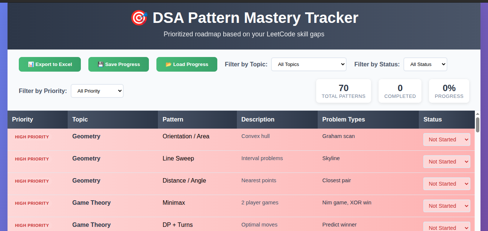
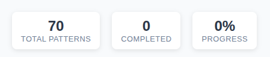

# 🎯 DSA Pattern Mastery Tracker

[](https://github.com/abdkhaleel/DSA-tracker)
[](https://opensource.org/licenses/MIT)
[](https://developer.mozilla.org/en-US/docs/Web/HTML)
[](https://developer.mozilla.org/en-US/docs/Web/JavaScript)

> **A comprehensive, interactive DSA pattern tracker designed to systematically master Data Structures & Algorithms for coding interviews and competitive programming.**

## 📋 Table of Contents

- [Overview](#-overview)
- [Features](#-features)
- [Getting Started](#-getting-started)
- [Usage](#-usage)
- [Pattern Categories](#-pattern-categories)
- [Priority System](#-priority-system)
- [Progress Persistence](#-progress-persistence)
- [Export Options](#-export-options)
- [Screenshots](#-screenshots)
- [Contributing](#-contributing)
- [License](#-license)
- [Support](#-support)

## 🌟 Overview

This DSA Pattern Tracker is a **personalized, data-driven learning system** that helps you master 65+ essential coding patterns across 19 major topics. Unlike generic problem lists, this tracker:

- **Intelligently prioritizes** patterns based on **YOUR actual LeetCode skill profile**
- **Customized learning path** - priorities calculated from your solved problem counts
- **Tracks your progress** with persistent data storage
- **Organizes patterns** by YOUR personal weakness areas
- **Exports data** to Excel for external use
- **Works completely offline** with no dependencies

> **🎯 Note**: The priority system in this tracker is specifically calibrated based on the creator's LeetCode profile (283 Array problems, 100 DP problems, etc.). Fork and customize the priorities to match YOUR skill profile!

Perfect for:
- 📚 **Students** preparing for placement interviews
- 💼 **Professionals** targeting FAANG companies
- 🏆 **Competitive programmers** improving problem-solving skills
- 🎯 **Anyone** wanting **personalized** DSA learning based on their skill profile

> **🔄 Adaptable**: While this version is optimized for a specific skill profile, you can easily customize the priorities to match YOUR LeetCode stats!

## ✨ Features

### 🎯 Smart Prioritization
- **High Priority**: Topics with major skill gaps (based on LeetCode profile analysis)
- **Medium Priority**: Areas needing improvement compared to strong topics
- **Low Priority**: Topics where you already have strong foundations

> **⚠️ Important**: The current priorities are based on a specific LeetCode profile:
> - **Strengths**: Arrays (283), DP (100), Hash Table (95), Strings (108)
> - **Weaknesses**: Geometry (0), Game Theory (0), Segment Trees (15)
> 
> **To customize**: Update the `dsaData` array in `index.html` with your own priorities!

### 📊 Interactive Interface
- **Real-time filtering** by topic, status, and priority
- **Progress statistics** with completion percentages
- **Color-coded priority** badges for quick identification
- **Responsive design** works on desktop and mobile

### 💾 Progress Persistence
- **Save/Load system** using JSON files
- **Excel export** for external tracking
- **No data loss** between sessions
- **Backup and restore** capabilities

### 📈 Comprehensive Coverage
- **65+ patterns** across all major DSA topics
- **Detailed descriptions** for each pattern
- **Real problem types** for practical understanding
- **Interview-focused** pattern selection

## 🚀 Getting Started

### Prerequisites
- Any modern web browser (Chrome, Firefox, Safari, Edge)
- No additional software installation required

### Installation

1. **Clone the repository**
   ```bash
   git clone https://github.com/abdkhaleel/DSA-tracker.git
   cd DSA-tracker
   ```

2. **Open the tracker**
   ```bash
   # Simply open the HTML file in your browser
   open index.html
   # or double-click the file in your file explorer
   ```

3. **Start tracking!**
   - No server setup required
   - Works completely offline
   - Ready to use immediately

## 🎮 Usage

### Basic Workflow

1. **Open `index.html`** in your preferred browser
2. **Review the prioritized list** - start with high-priority patterns
3. **Update status** as you progress:
   - 🔴 **Not Started**: Haven't begun this pattern
   - 🟡 **In Progress**: Currently learning/practicing
   - 🟢 **Completed**: Mastered this pattern
4. **Save progress** before closing the browser
5. **Load progress** when you return

### Advanced Usage

#### Filtering Options
```
Filter by Topic: Focus on specific areas (Arrays, DP, Graphs, etc.)
Filter by Status: See only patterns you're working on
Filter by Priority: Focus on your weakness areas first
```

#### Progress Tracking
```
Total Patterns: 65+ comprehensive patterns
Completed: Your finished patterns
Progress %: Overall completion percentage
```

## 📚 Pattern Categories

### High Priority (Immediate Focus) 🔥
**Based on 0 problems solved in these areas:**
- **Geometry**: Computational geometry problems
- **Game Theory**: Strategic decision-making problems
- **Segment Trees & BIT**: Advanced range query data structures

### Medium Priority (Skill Building) 🎯
**Based on <50 problems solved, need improvement:**
- **Tries**: Prefix-based string problems (12 solved)
- **Union Find**: Connectivity and disjoint set problems (16 solved)
- **Divide & Conquer**: Recursive problem-solving (19 solved)
- **Binary Search**: Search space optimization (48 solved)
- **Graphs**: Network and pathfinding problems

### Low Priority (Strong Foundation) ✅
**Based on 60+ problems solved, maintain proficiency:**
- **Arrays**: Foundation pattern mastery (283 solved)
- **Dynamic Programming**: Optimization problems (100 solved)
- **Hash Tables**: Fast lookup and counting (95 solved)
- **Strings**: Text processing algorithms (108 solved)
- **Math**: Mathematical problem solving (57 solved)

## 🎨 Priority System

The tracker uses a **personalized, data-driven prioritization** system based on LeetCode profile analysis:

### Current Priority Calculation (Based on Sample Profile)
```javascript
// Based on LeetCode stats: Arrays(283), DP(100), Hash(95), etc.
High Priority = Topics with 0-20 solved problems (Major gaps)
Medium Priority = Topics with 21-60 solved problems (Need improvement)  
Low Priority = Topics with 60+ solved problems (Strong foundation)
```

### 🔧 Customization Guide
**To adapt this tracker for YOUR profile:**

1. **Analyze your LeetCode skills** (Profile → Skills section)
2. **Update priorities** in the `dsaData` array:
   ```javascript
   // Example: If you're weak in Trees but strong in Arrays
   { topic: "Trees", priority: "High" },     // Your weakness
   { topic: "Arrays", priority: "Low" },     // Your strength
   ```
3. **Reorder the array** to put YOUR weaknesses first

### Current Profile Basis
This tracker is optimized for someone with:
- **Strong in**: Arrays, DP, Hash Tables, Strings, Math
- **Moderate in**: Trees, Stacks, Binary Search, Greedy
- **Weak in**: Geometry, Game Theory, Advanced Data Structures

### Visual Indicators
- 🔴 **Red badges**: High priority (urgent)
- 🟡 **Orange badges**: Medium priority (important)
- 🟢 **Green badges**: Low priority (maintenance)

## 💾 Progress Persistence

### Save Progress
```
1. Click "💾 Save Progress" button
2. Downloads: DSA_Progress_YYYY-MM-DD.json
3. Store in a safe location
```

### Load Progress
```
1. Click "📂 Load Progress" button
2. Select your saved .json file
3. All progress restored instantly
```

### Backup Strategy
```
Weekly: Save progress JSON file
Monthly: Export to Excel for long-term backup
Version control: Keep multiple progress snapshots
```

## 📤 Export Options

### Excel Export
- Complete tracker data in Excel format
- Includes all columns: Topic, Pattern, Description, Problem Types, Status
- Perfect for sharing with mentors or study groups

### JSON Export
- Lightweight progress data
- Human-readable format
- Easy backup and restore

## 📸 Screenshots

### Main Interface

*Interactive tracker with priority-based sorting and real-time filtering*

### Progress Statistics

*Real-time completion tracking and progress visualization*

### Export Features

*Save progress and export to Excel for external use*

## 🎯 Study Strategy

### Recommended Approach

#### Week 1-2: High Priority Focus
```
✅ Start with Geometry patterns
✅ Learn Game Theory basics  
✅ Master Segment Tree fundamentals
```

#### Week 3-6: Medium Priority Building
```
✅ Implement Trie-based solutions
✅ Practice Union Find problems
✅ Strengthen Graph algorithms
```

#### Week 7+: Comprehensive Practice
```
✅ Review and reinforce Low Priority patterns
✅ Solve mixed difficulty problems
✅ Focus on interview-style questions
```

### Pattern Mastery Checklist
- [ ] Understand the core concept
- [ ] Implement the basic algorithm
- [ ] Solve 3-5 related problems
- [ ] Identify variations and edge cases
- [ ] Mark as "Completed" in tracker

## 🤝 Contributing

We welcome contributions to improve the DSA Pattern Tracker!

### Ways to Contribute

1. **Add New Patterns**
   ```javascript
   // Add to dsaData array in index.html
   { 
     topic: "New Topic", 
     pattern: "Pattern Name", 
     description: "Brief description", 
     problemTypes: "Example problems", 
     priority: "High/Medium/Low" 
   }
   ```

2. **Improve UI/UX**
   - Enhance responsive design
   - Add new filtering options
   - Improve accessibility

3. **Documentation**
   - Add more screenshots
   - Create video tutorials
   - Improve README sections

### Contribution Process

1. **Fork** the repository
2. **Create** a feature branch (`git checkout -b feature/AmazingFeature`)
3. **Commit** your changes (`git commit -m 'Add some AmazingFeature'`)
4. **Push** to the branch (`git push origin feature/AmazingFeature`)
5. **Open** a Pull Request

## 📝 License

This project is licensed under the MIT License - see the [LICENSE](LICENSE) file for details.

```
MIT License

Copyright (c) 2024 Abdul Khaleel

Permission is hereby granted, free of charge, to any person obtaining a copy
of this software and associated documentation files (the "Software"), to deal
in the Software without restriction, including without limitation the rights
to use, copy, modify, merge, publish, distribute, sublicense, and/or sell
copies of the Software, and to permit persons to whom the Software is
furnished to do so, subject to the following conditions:

The above copyright notice and this permission notice shall be included in all
copies or substantial portions of the Software.
```

## 💬 Support

### Get Help

- 📖 **Documentation**: Check this README and code comments
- 🐛 **Bug Reports**: [Create an issue](https://github.com/abdkhaleel/DSA-tracker/issues)
- 📧 **Direct Contact**: [Email me](mailto:abdkhaleel16@gmail.com)

### Community

- ⭐ **Star this repo** if you find it helpful
- 🍴 **Fork** to create your own version
- 📢 **Share** with friends preparing for interviews
- 💝 **Contribute** to make it better for everyone

## 📊 Project Statistics

- **65+ Patterns**: Comprehensive coverage
- **19 Topics**: All major DSA areas
- **3 Priority Levels**: Smart learning progression
- **100% Offline**: No internet required
- **0 Dependencies**: Pure HTML/CSS/JavaScript

## 🏆 Success Stories

> *"This tracker helped me systematically prepare for my Google interview. The priority system ensured I focused on my weak areas first!"* - Anonymous User

> *"Finally, a structured approach to DSA learning. No more random problem solving!"* - GitHub User

---

<div align="center">

**Made with ❤️ for the coding community**

[⭐ Star this repo](https://github.com/abdkhaleel/DSA-tracker/stargazers) · [🐛 Report Bug](https://github.com/abdkhaleel/DSA-tracker/issues) · [💡 Request Feature](https://github.com/abdkhaleel/DSA-tracker/issues)

</div>